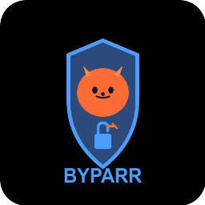

# Home Assistant Add-on: Byparr



## About

Byparr is a modern proxy server designed to bypass Cloudflare and other anti-bot protection systems. It serves as a drop-in replacement for FlareSolverr, using the Camoufox browser engine (Firefox-based) for realistic browser fingerprinting.

## Features

- **FlareSolverr API Compatible**: Drop-in replacement using the same API and port (8191)
- **Advanced Browser Engine**: Uses Camoufox (Firefox-based) for better anti-bot bypass
- **FastAPI Backend**: Modern Python 3.13 with FastAPI framework
- **Interactive Documentation**: Swagger UI available at `/docs` endpoint
- **Proxy Support**: Optional upstream proxy configuration
- **Health Monitoring**: Built-in health check endpoint

## Installation

1. Add this repository to your Home Assistant add-on store
2. Install the "Byparr" add-on
3. Configure the add-on (see Configuration section)
4. Start the add-on
5. Check the logs to verify it's running correctly

## Configuration

### Basic Options

```yaml
log_level: info
```

- **log_level** (optional): Set logging verbosity
  - `debug`: Detailed debugging information
  - `info`: General information (default)
  - `warning`: Warning messages only
  - `error`: Error messages only

### Proxy Options

```yaml
proxy_server: "http://proxy.example.com:8080"
proxy_username: "user"
proxy_password: "pass"
```

- **proxy_server** (optional): Upstream proxy server URL
  - Format: `protocol://host:port`
  - Example: `http://10.0.0.1:3128`
- **proxy_username** (optional): Proxy authentication username
- **proxy_password** (optional): Proxy authentication password

### Example Configuration

```yaml
log_level: info
proxy_server: "http://192.168.1.100:3128"
proxy_username: "myuser"
proxy_password: "mypassword"
```

## Usage

### API Endpoint

Once started, Byparr is available at:
- **API**: `http://homeassistant.local:8191`
- **Documentation**: `http://homeassistant.local:8191/docs`

### Integration with *arr Applications

Byparr is fully compatible with FlareSolverr configuration in Prowlarr, Sonarr, Radarr, etc.

#### Prowlarr Configuration

1. Go to Settings → Indexers
2. Click "Add Indexer Proxy"
3. Select "FlareSolverr"
4. Configure:
   - **Host**: `http://homeassistant.local` (or your HA IP)
   - **Port**: `8191`
   - **Tags**: Select indexers that need bypass
5. Test and Save

#### Sonarr/Radarr Configuration

1. Go to Settings → Indexers
2. Add or edit an indexer
3. In the indexer settings, find "FlareSolverr Tags"
4. Ensure your FlareSolverr proxy is configured in Prowlarr

### API Example

```bash
# Test the API
curl -X POST http://homeassistant.local:8191/v1 \
  -H "Content-Type: application/json" \
  -d '{
    "cmd": "request.get",
    "url": "https://example.com"
  }'
```

### Health Check

```bash
curl http://homeassistant.local:8191/health
```

## System Requirements

⚠️ **Important**: Byparr requires significant system resources:

- **CPU**: Minimum 2 cores recommended
- **RAM**: Minimum 4 GB available RAM
- **Disk**: ~1.5 GB for image and runtime
- **Architecture**: amd64 only

Systems below these specifications may experience crashes or become unresponsive.

## Architecture Support

- ✅ **amd64**: Fully supported and tested
- ⚠️ **aarch64/armv7**: Not supported in this release (limited upstream ARM support)

## Limitations

- Does not guarantee successful bypass for all anti-bot challenges
- Requires legitimate traffic from your public IP for some validations
- Resource-intensive compared to lightweight proxies
- ARM architecture support is limited

## Troubleshooting

### Add-on Won't Start

1. Check system resources (CPU, RAM)
2. Review add-on logs for error messages
3. Ensure port 8191 is not in use by another service
4. Verify your system meets minimum requirements

### API Returns Errors

1. Check the Swagger UI at `/docs` for valid request format
2. Increase log level to `debug` for detailed information
3. Some sites may still detect and block automated requests
4. Ensure you have sufficient system resources available

### Integration Issues

1. Verify the add-on is running (check logs)
2. Test the health endpoint: `curl http://homeassistant.local:8191/health`
3. Ensure *arr applications can reach Home Assistant on port 8191
4. Check firewall rules if running HA on a separate machine

## Differences from FlareSolverr

| Feature | FlareSolverr | Byparr |
|---------|-------------|---------|
| Browser Engine | Chromium | Firefox (Camoufox) |
| Language | JavaScript | Python 3.13 |
| Image Size | ~800 MB | ~1.1 GB |
| API | Compatible | 100% Compatible |
| Fingerprinting | Basic | Advanced (Camoufox) |

## Support

- **Byparr Project**: [https://github.com/ThePhaseless/Byparr](https://github.com/ThePhaseless/Byparr)
- **Home Assistant Community**: [Home Assistant Forums](https://community.home-assistant.io/)
- **Issue Reporting**: Report add-on specific issues to the add-on repository

## License

This add-on uses the Byparr project, which has its own license. Please refer to the [Byparr GitHub repository](https://github.com/ThePhaseless/Byparr) for license information.

## Credits

- **Byparr**: Created by [ThePhaseless](https://github.com/ThePhaseless)
- **Camoufox**: Advanced browser fingerprinting engine
- **FlareSolverr**: Original project inspiration

## Changelog

See [CHANGELOG.md](CHANGELOG.md) for version history.
